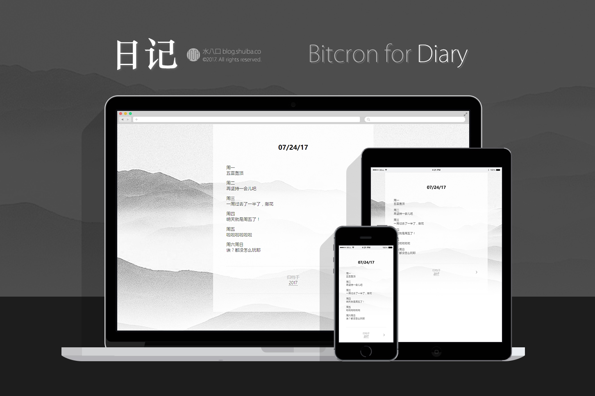

## 开始写日记吧

1. 创建一个文件夹，命名为 `年份`，比如今年就是 `2017`；
2. 在文件夹 `2017` 中创建一个 Markdown 文档，标题为 `今日四位日期.md`，比如 `0724.md`；
3. 在 `0724.md` 中写下今天的日记；
4. 保存并刷新网页，日记就会出现在网站上。Enjoy!

虽然我建议日记都在当日完成，错过了就既往不咎。不过如果你想要补全日记，可以在文档头部、正文之前写下日期：`date: 2017-07-21`。这样相当于自定义日期，覆盖了系统记录的真正的写作时间。

```
date: yyyy-mm-dd

空一行写正文即可
```

在 Bitcron 里，文件夹即是分类。如此分类，不仅本地文件夹井然有序，网站地址也会显示为 `域名/2017/0724`，日记日期一目了然，想要查找某天的日记也可以直接输入网址。比如想看看2013年5月2日的日记，输入 `域名/2013/0502` 就好。
